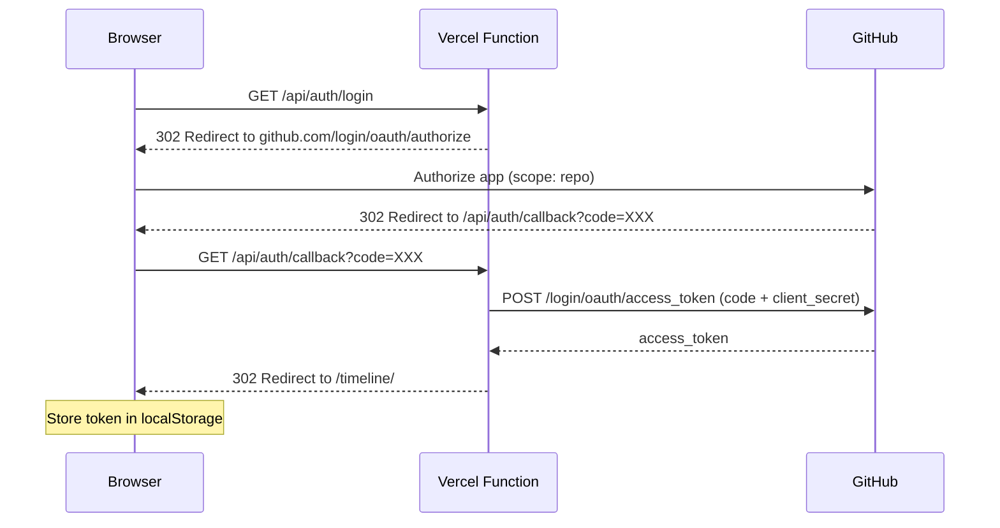
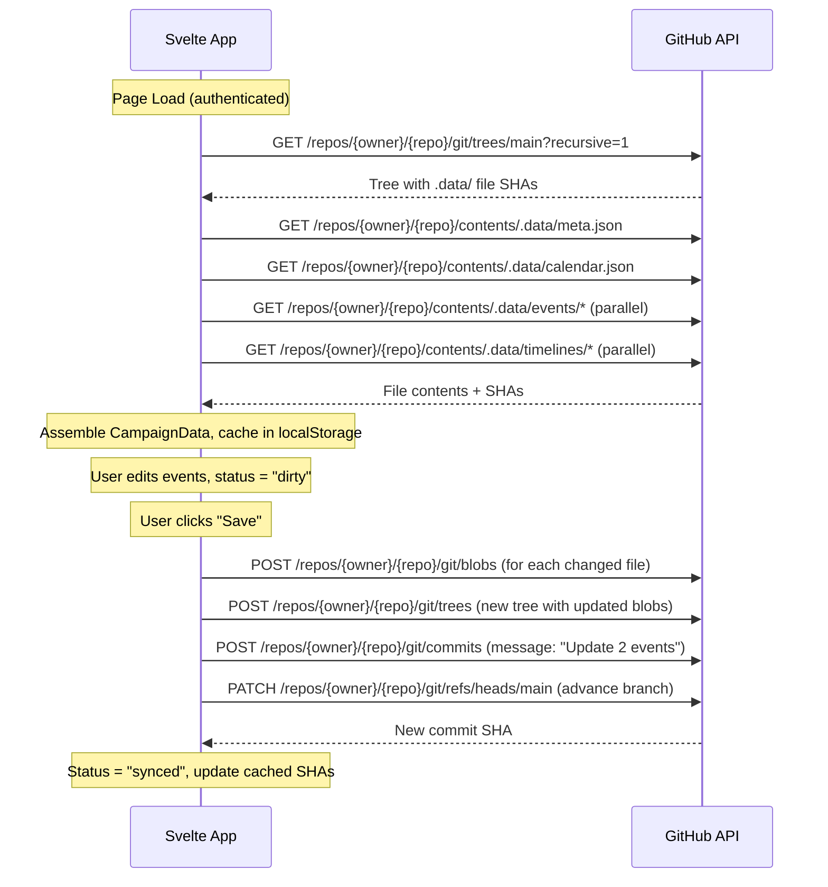

# GitHub as Database for Frozen Sick

## Current State

The timeline app persists data via `localStorage` in `[timeline/src/utils/storage.ts](timeline/src/utils/storage.ts)`. The `persist()` function in `[timeline/src/store/campaign.svelte.ts](timeline/src/store/campaign.svelte.ts)` calls `saveCampaign(data)` which writes to `localStorage`. Data is browser-local -- lost on storage clear, inaccessible from other devices or by other group members.

## Architecture

**Option B (sharded dot files)** + **GitHub OAuth** + **direct client-side GitHub API** + **hybrid persistence**.

Each user signs in with GitHub. The browser calls the GitHub API directly using their OAuth token. Commits are attributed to the user who made the change. One minimal Vercel serverless function handles only the OAuth token exchange.

---

## 1. Dot File Structure

Split `CampaignData` into granular files under `.data/`:

```
.data/
  meta.json                    # { campaignId, campaignName, version }
  calendar.json                # CalendarConfig
  timelines/
    main-story.json            # single CampaignTimeline object
    tidus.json
    nixira.json
    zacarias.json
  events/
    ch1-tavern.json            # single CampaignEvent object
    ch2-plateau.json
    ch3-turtle.json
    ch4-battle.json
    ch5-escape.json
    tidus-medallion.json
```

File names use the entity `id` as the filename. Each file contains a single JSON object (pretty-printed for readable diffs).

---

## 2. GitHub OAuth Flow

### Prerequisites

1. Create a **GitHub OAuth App** at github.com/settings/developers
2. Set callback URL to `https://your-vercel-domain.vercel.app/api/auth/callback`
3. Add `GITHUB_CLIENT_ID` and `GITHUB_CLIENT_SECRET` as Vercel environment variables
4. Add repo collaborator access for each D&D group member

### Auth Flow




### Serverless Functions (only 2, only for auth)

- `**api/auth/login.ts**` -- Redirects to GitHub OAuth authorize URL with `client_id` and `scope=repo`
- `**api/auth/callback.ts**` -- Receives `code` from GitHub, exchanges it for `access_token` using `client_secret`, redirects back to the app with the token in the URL fragment (fragment never hits the server)

After auth, **all GitHub API calls happen directly from the browser** using the token. No proxy needed.

---

## 3. Read/Write Flow (Client-Side)




The **Git Trees API** is used for saves so that multiple file changes (e.g., editing 3 events) become a **single atomic commit** rather than 3 separate commits.

---

## 4. Dual Persistence (localStorage + GitHub)

- **localStorage** remains the instant write-through cache (fast, offline-capable)
- **GitHub** is the source of truth (shared, versioned, persistent)
- On page load: try GitHub first, fall back to localStorage if offline/unauthenticated
- On mutation: write to localStorage immediately, mark state as "dirty"
- On explicit "Save": batch dirty changes into one GitHub commit
- Unauthenticated users can still use the app with localStorage only (read-only mode for GitHub data could also work)

---

## 5. Multi-User Considerations

- Each group member authenticates with their own GitHub account
- Commits are attributed to the person who saved (GitHub API uses their token)
- Users must be **collaborators** on the repo (or the repo must be public with appropriate permissions)
- Conflict handling: check the branch HEAD SHA before committing. If someone else pushed while you were editing, show a warning and offer to pull latest first ("Someone else saved changes. Pull latest before saving?")
- The Git Trees API's base_tree parameter naturally handles this -- if the base tree is stale, the commit still works but could overwrite changes (so the HEAD check is important)

---

## 6. Commit Messages

Auto-generated based on what changed:

- "Add event: The Dragon's Lair" (single entity)
- "Update event: Battle of Brasboredon" (single entity)
- "Delete timeline: Nixira's Arc" (single entity)
- "Update 3 events, 1 timeline" (batch)
- "Update calendar configuration" (calendar change)

Commit author = the authenticated GitHub user.

---

## 7. Files to Create/Modify

### New Files

- `**api/auth/login.ts**` -- Vercel serverless: redirect to GitHub OAuth
- `**api/auth/callback.ts**` -- Vercel serverless: exchange code for token
- `**timeline/src/utils/auth.ts**` -- Token storage, user info, login/logout
- `**timeline/src/utils/github.ts**` -- GitHub API client: loadFromGitHub(), saveToGitHub(), uses Git Trees API for atomic multi-file commits
- `**.data/meta.json**` -- Seed file
- `**.data/calendar.json**` -- Seed file
- `**.data/timelines/*.json**` -- Seed files (one per timeline)
- `**.data/events/*.json**` -- Seed files (one per event)

### Modified Files

- `**[timeline/src/utils/storage.ts](timeline/src/utils/storage.ts)**` -- Add GitHub load/save alongside localStorage, add diffing to detect which files changed
- `**[timeline/src/store/campaign.svelte.ts](timeline/src/store/campaign.svelte.ts)**` -- Add auth state (`user`, `token`), sync state (`synced | dirty | saving | error`), dirty tracking (which entities changed), `saveToGitHub()` and `loadFromGitHub()` actions
- `**[timeline/src/App.svelte](timeline/src/App.svelte)**` -- Add login/logout button with GitHub avatar, sync status badge, explicit "Save to GitHub" button, pull-on-load logic
- `**[vercel.json](vercel.json)**` -- May need rewrite rules for `/api/auth/*`
- `**[.gitignore](.gitignore)**` -- Ensure `.data/` is NOT ignored
- `**[timeline/package.json](timeline/package.json)**` -- Add `octokit` dependency (lightweight GitHub API client)

