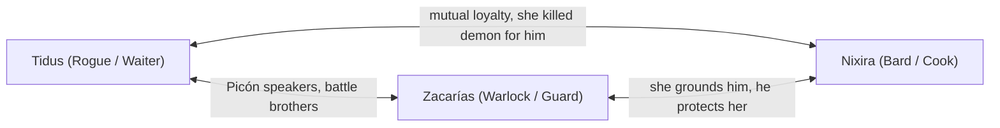
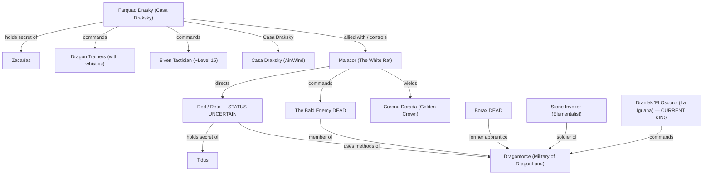
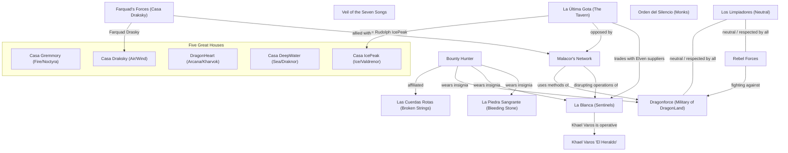

# Relations — Frozen Sick

*Last updated after Chapter 4*

---

## Party Relationships

---

## Enemy Network

---

## PC to NPC Connections

```mermaid
graph TD
    subgraph pcs [Player Characters]
        Tidus["Tidus"]
        Zacarias["Zacarías"]
        Nixira["Nixira"]
    end

    subgraph allies [Allies]
        Lunei["Lunei Milei Maili (Boss DYING)"]
        Dracus["Dracus (El Manco)"]
        Nadie["Señor Nadie (Master Monk)"]
        Hook["Hook (Twin Elf)"]
        Line["Line (Rock Wyrmling)"]
        Robinson["Robinson (Companion)"]
        Bixira["Bixira (Rebel Commander)"]
    end

    subgraph enemies [Enemies]
        Malacor["Malacor"]
        Farquad["Farquad Drasky (Casa Draksky)"]
        Veil["Veil of the Seven Songs"]
        Keylan["Keylan"]
        Borax2["Borax DEAD"]
        StoneInv["Stone Invoker"]
        DwarfMother["Dwarf Mother"]
        Dranlek["Dranlek El Oscuro (La Iguana) — KING"]
    end

    subgraph unknown [Unknown Alignment]
        BountyHunter["Bounty Hunter"]
        MysteryWoman["Mysterious Woman (Crimson Eyes)"]
        Rainbow["Rainbow — STATUS UNCERTAIN"]
        Red2["Red — STATUS UNCERTAIN"]
    end

    Tidus -->|"employer"| Lunei
    Tidus -->|"secret held by (uncertain status)"| Red2
    Tidus -->|"old companion"| Dracus
    Tidus -->|"tamed"| Line
    Tidus -->|"former member"| Dragonforce2["Dragonforce"]
    Tidus -->|"killed (mercy)"| Borax2
    Tidus -->|"Val medallion (1/20)"| Val["Val (God of Death)"]

    Zacarias -->|"employer"| Lunei
    Zacarias -->|"secret held by"| Farquad
    Zacarias -->|"patron pact"| Malfas["Malfas (Prince of Ravens)"]
    Zacarias -->|"former friend / now enemy"| Malacor
    Zacarias -->|"ally"| Nadie
    Zacarias -->|"lost right hand to"| StoneInv

    Nixira -->|"employer"| Lunei
    Nixira -->|"former member"| Veil
    Nixira -->|"betrayed by"| Keylan
    Nixira -->|"bitter rival; he held her secret"| Rainbow
    Nixira -->|"song for"| Rodrigo2["Rodrigo DEAD"]
    Nixira -->|"companion"| Robinson
    Nixira -->|"cursed by (asesina de niños)"| DwarfMother
    Nixira -->|"fighting alongside"| Bixira

    Lunei -->|"cut wings off"| Victus2["Victus DEAD"]
    Dracus -->|"entangled with"| Malacor
```

---

## Organization Relationships

---

## Timeline of Key Relationships

| When | Event | Relationships Formed/Broken |
|------|-------|-----------------------------|
| ~90 years ago | Southern elven tribe destroyed | Tidus loses his people; taken in by northern tribe |
| Years ago | Tidus joins Dragonforce | Tidus ↔ Dragonforce (military of DragonLand), Tidus ↔ Dragonborn royalty |
| Years ago | Tidus & Dracus run missions together | Tidus ↔ Dracus (old companions) |
| Years ago | Borax serves as castle apprentice under Tidus | Tidus ↔ Borax (superior/subordinate, envy) |
| Years ago | Zacarías & Malacor are close friends | Zacarías ↔ Malacor (brothers in faith) |
| Years ago | Zacarías loses paladin powers, pacts with Malfas | Zacarías ↔ Malfas (patron) |
| >5 years ago | Nixira flees the Veil of the Seven Songs | Nixira vs. Keylan, Nixira vs. Veil |
| ~2 years ago | All three PCs join the tavern | PCs ↔ Lunei (employer) |
| Ch.1 | Bounty hunter arrives, chaos erupts | Red vs. PCs, Bald Enemy vs. PCs |
| Ch.1 | Nixira's identity exposed | Nixira exposed to Veil hunters |
| Ch.1 | Zacarías reveals Malacor connection | Zacarías vs. Malacor (personal vendetta) |
| Ch.2 | Dracus proposes alliance against Malacor | PCs ↔ Dracus (reluctant allies) |
| Ch.2 | Tidus tames Line | Tidus ↔ Line (dragon rider bond) |
| Ch.2 | Farquad captures the party | PCs vs. Farquad |
| Ch.3 | Zacarías allies with Señor Nadie | Zacarías ↔ Nadie (mutual respect) |
| Ch.3 | Nixira kills Victus | Nixira → Victus (mercy killing) |
| Ch.3 | Nixira dedicates kill to Zacarías | Nixira ↔ Zacarías (deepened bond) |
| Ch.4 | Tidus kills Borax (mercy kill) | Tidus → Borax (resolved rivalry), Tidus ↔ Val (god of death) |
| Ch.4 | Nixira cursed by dwarf mother | Nixira vs. Dwarves (racial stigma) |
| Ch.4 | Zacarías loses right hand to stone invoker | Zacarías vs. Stone Invoker |
| Ch.4 | Nixira allies with Robinson and Bixira | Nixira ↔ Robinson (companion), Nixira ↔ Bixira (rebel alliance) |
| Ch.4 | Party separated across Dragon Born | All PCs isolated — bonds tested by distance |
