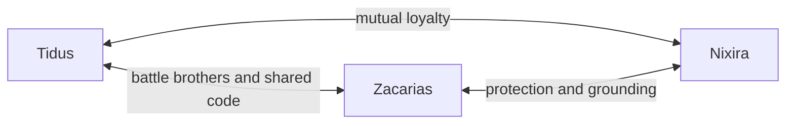
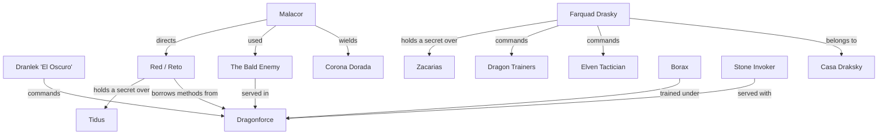
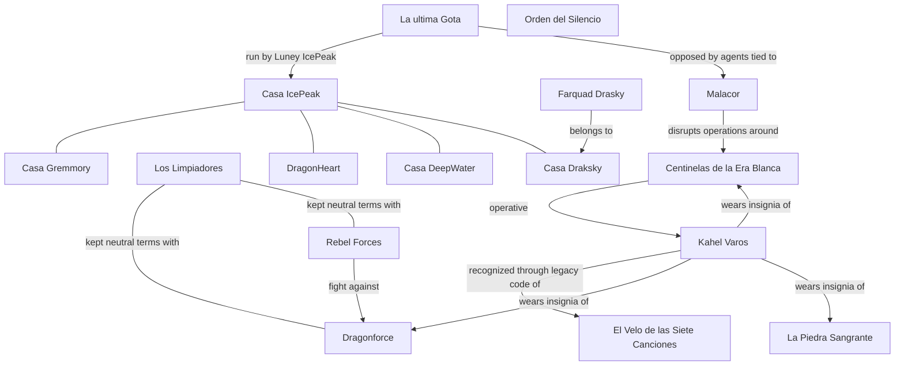

# Relations - Frozen Sick

*Last updated after Chapter 6*

---

## Party Relationships

---

## Enemy Pressure Network

---

## PC to NPC Connections

```mermaid
flowchart TD
    subgraph PCs
        Tidus["Tidus"]
        Zacarias["Zacarias"]
        Nixira["Nixira"]
    end

    subgraph Allies
        Luney["Luney IcePeak"]
        Dracus["Dracus"]
        Nadie["Senor Nadie"]
        Hook["Hook"]
        Chimuelo["Chimuelo"]
        Robinson["Robinson"]
        Bixira["Bixira"]
    end

    subgraph Threats
        Malacor["Malacor"]
        Farquad["Farquad Drasky"]
        Velo["El Velo de las Siete Canciones"]
        Kaelan["Kaelan Thorne 'La Cuerda Rota'"]
        Borax["Borax"]
        StoneInvoker["Stone Invoker"]
        DwarfMother["Dwarf Mother"]
        Dranlek["Dranlek"]
    end

    Tidus -->|"served under"| Luney
    Tidus -->|"old companion"| Dracus
    Tidus -->|"tamed"| Chimuelo
    Tidus -->|"former member of"| DragonforceRef["Dragonforce"]
    Tidus -->|"killed in mercy"| Borax
    Tidus -->|"claimed by"| Bhaal["Bhaal"]

    Zacarias -->|"served under"| Luney
    Zacarias -->|"secret exposed to"| Farquad
    Zacarias -->|"pact with"| Malfas["Malfas"]
    Zacarias -->|"former friend turned enemy"| Malacor
    Zacarias -->|"ally of"| Nadie
    Zacarias -->|"maimed by"| StoneInvoker

    Nixira -->|"served under"| Luney
    Nixira -->|"former member of"| Velo
    Nixira -->|"betrayed by"| Kaelan
    Nixira -->|"rivalry with"| Rainbow["Rainbow"]
    Nixira -->|"companion of"| Robinson
    Nixira -->|"fighting beside"| Bixira
    Nixira -->|"cursed by"| DwarfMother

    Luney -->|"mutilated"| Victus["Victus"]
    Dracus -->|"entangled with"| Malacor
```

---

## World and Organization Relationships

---

## Timeline of Key Relationships

| When | Event | Relationships formed or broken |
|------|-------|--------------------------------|
| ~90 years ago | Southern elven tribe destroyed | Tidus loses his people and is displaced north |
| Years ago | Tidus joins Dragonforce | Tidus is tied to Dragonforce and Dragonborn rule |
| Years ago | Tidus and Dracus run missions together | Tidus and Dracus become old companions |
| Years ago | Borax serves under Tidus | Tidus and Borax form a bitter superior-subordinate bond |
| Years ago | Zacarias and Malacor are close friends | Zacarias and Malacor become spiritually entangled |
| Years ago | Zacarias pacts with Malfas | Zacarias gains a dangerous patron |
| More than 5 years ago | Nixira flees El Velo de las Siete Canciones | Nixira breaks with Kaelan Thorne "La Cuerda Rota" and the order |
| Around 2 years ago | The party settles into La ultima Gota | The three PCs become tied to Luney |
| Chapter 1 | Kahel Varos arrives at the tavern | Red and the Bald Enemy enter the conflict |
| Chapter 1 | Nixira is exposed | El Velo de las Siete Canciones can start closing in |
| Chapter 1 | Zacarias reveals the Malacor connection | Personal conflict with Malacor hardens |
| Chapter 2 | Dracus proposes an alliance | The party and Dracus become reluctant allies |
| Chapter 2 | Tidus tames Chimuelo | Rider bond established |
| Chapter 2 | Farquad captures the party | Conflict with Casa Draksky intensifies |
| Chapter 3 | Zacarias allies with Senor Nadie | Mutual respect and shared purpose form |
| Chapter 3 | Nixira kills Victus | Nixira closes one thread through mercy killing |
| Chapter 6 | Tidus kills Borax | A long rivalry ends violently |
| Chapter 6 | Nixira is cursed by the dwarf mother | Her social and spiritual burden deepens |
| Chapter 6 | Zacarias loses his right hand to the stone invoker | That feud becomes personal and permanent |
| Chapter 6 | Nixira aligns with Robinson and Bixira | Rebel ties strengthen |
